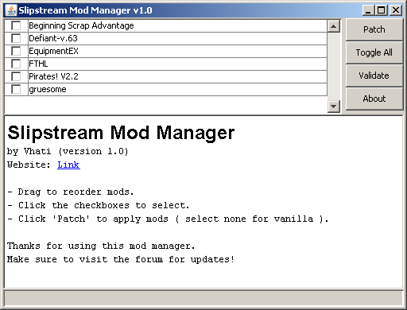

# Slipstream Mod Manager

Slipstream is a mod manager for the game FasterThanLight
([FTL](https://subsetgames.com/ftl.html)), making it easy to install multiple
mods at the same time and, later, revert to vanilla gameplay.

It is the successor to Grognak's Mod Manager
([GMM](https://subsetgames.com/forum/viewtopic.php?p=9994)).

## Requirements

-   Java (1.6 or higher).
    -   <http://www.java.com/en/download/>
-   FTL (1.01-1.6.3, Windows/OSX/Linux, Steam/GOG/Standalone).
    -   <https://subsetgames.com/>
-   WinXP SP1 can't run Java 1.7.
    -   (1.7 was built with VisualStudio 2010, causing a DecodePointer error.)
    -   To get 1.6, you may have to google "jdk-6u45-windows-i586.exe".

## Directory structure

-   `assets/`
    -   Screenshots.
-   `skel_common/`
    -   Files to include in distribution archives.
-   `skel_win/` and `skel_unix/`
    -   System-specific files to include in distribution archives.
-   `skel_exe/`
    -   Materials to create modman.exe (not part of Maven).
        -   [Get Launch4j](http://launch4j.sourceforge.net/index.html)
        -   Drag "launch4j_*.xml" onto "launch4jc.exe".
        -   "modman.exe" will appear alongside the xml.
        -   Drag modman.exe into "skel_win/".
        -   Run "mvn clean package".
    -   The manifest files will be embedded to
        [prevent VirtualStore redirection](http://www.codeproject.com/Articles/17968/Making-Your-Application-UAC-Aware).
-   `auto_update.json`
    -   Info about the latest release, downloaded periodically by clients.

## Building

The build process for this project is automated by
[Maven](http://maven.apache.org/) ([guide](http://docs.codehaus.org/display/MAVENUSER/Getting+Started+with+Maven)).

1.  Open the repository in the provided Visual Studio Code devcontainer.
2.  Run `mvn package` from the repository root to compile the source and
    generate a zip file containing the compiled assets for each platform in the
    `target` directory.

## Dependencies

This project depends on the following libraries.

-   [Apache HttpComponents](https://hc.apache.org/) (For JavaDocs, click
    HttpCore or HttpClient, then again under "Project reports".)
-   [Jackson JSON Processor 2.x](http://jackson.codehaus.org/Home) (For
    JavaDocs, look right.)
-   [PNGJ](https://code.google.com/p/pngj/) (For JavaDocs, scroll down.)
-   [JDOM 2.x](http://www.jdom.org/) (For JavaDocs, look left.)
-   [SLF4J](https://www.slf4j.org/) (For JavaDocs, look left.)
-   [Logback](https://logback.qos.ch/) (For JavaDocs, look left.)
-   [picocli 2.x](http://picocli.info/) (For JavaDocs, look left and scroll
    down to "API Javadoc".)

## Downloads, comments and donations

[Download compiled binaries](https://sourceforge.net/projects/slipstreammodmanager/).

Comments can be made in [this forum thread](https://subsetgames.com/forum/viewtopic.php?f=12&t=17102).

I can accept [PayPal donations](https://vhati.github.io/donate.html). That
would be fantastic.
